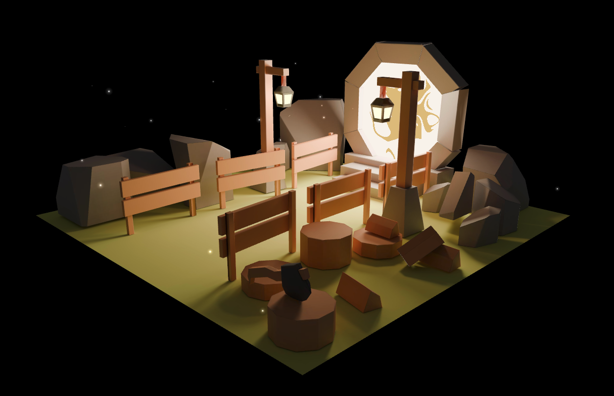
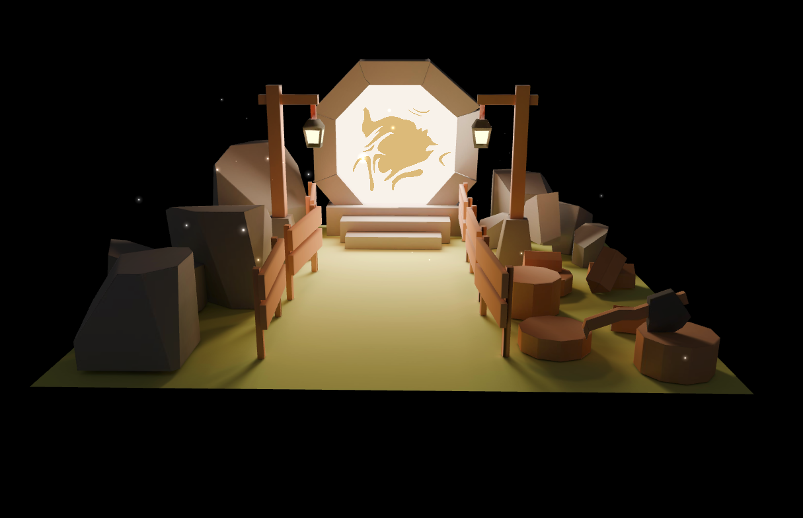
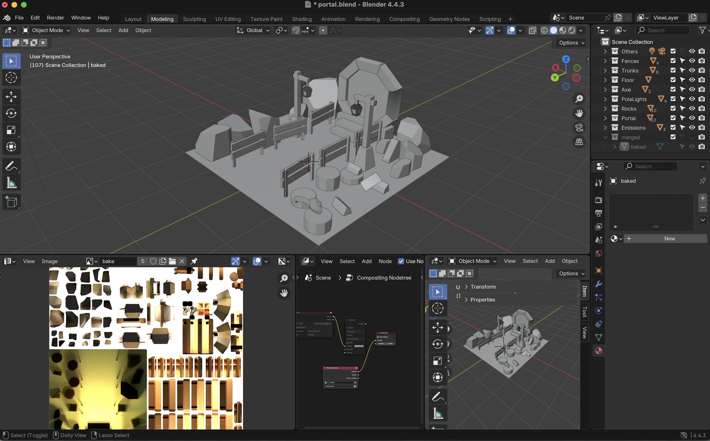

# Three.js Personal project - Portal Scene
This is the three.js personal project. Use Blender to create "Portal Scene", bake it, export it, and import it into Three.js  

## Table of Contents
1. Image
2. Process
3. Setup
4. Live Demo

## Image




## Process
To create a baked scene, follow these simple steps:
-   Make the scene in 3D software.
-  Clean up and optimize the geometry (keep only visible surfaces).
-  UV unwrap all objects.
-  Bake lighting into texture(s).
-  Export the scene and texture(s). You can use one big texture or several smaller ones for better quality.
-  Import everything into Three.js and apply the texture to the mesh.

## Setup
Download [Node.js](https://nodejs.org/en/download/).
Run this followed commands:

``` bash
# Install dependencies (only the first time)
npm install

# Run the local server at localhost:8080
npm run dev

# Build for production in the dist/ directory
npm run build
```

## Live Demo
[Live](https://three-js-portal-peach.vercel.app/)